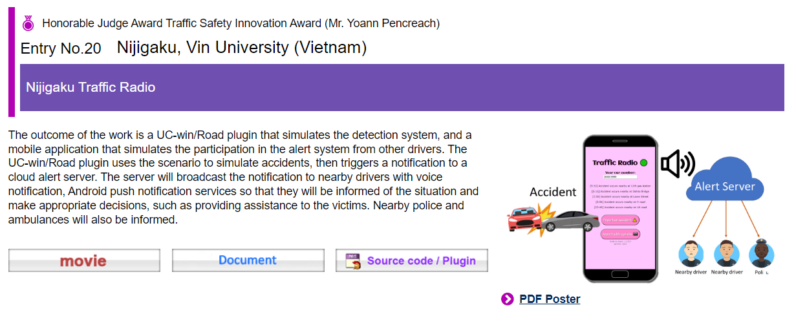

# Nijigaku Traffic Radio

### a.k.a. NTR プロジェクト

Real-time Detection and Alert System for Vehicle Crash simulated in FORUM8 UC-win/Road.

This project was created for the 10th Cloud Programming World Cup by FORUM8.

**Oct 14th, 2022 update:** we get to Tokyo, Japan this November! 一緒に 日本 へ 行きましょう!

**Nov 17th, 2022 update:** we got an [Honorable Judge Award for Traffic Safety Innovation!](https://cpwc.forum8.co.jp/english/#:~:text=Honorable%20Judge%20Award%20Traffic%20Safety%20Innovation%20Award%20(Mr.%20Yoann%20Pencreach)). Many thanks to the FORUM8 Company, CPWC judges and staffs for this honor!

